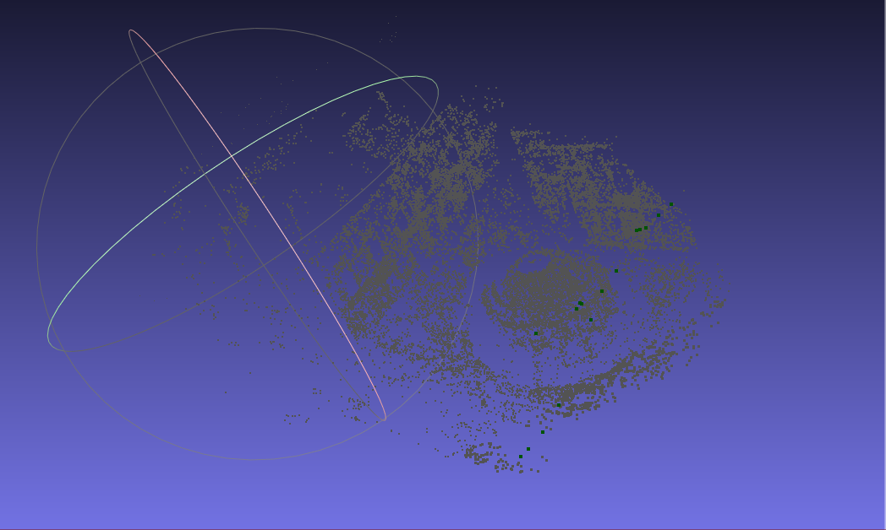

<div>
    <a href="./README.md">English</a>|
    <a href="./README.zh-CN.md">简体中文</a>
</div>

# <center>solveBAL

Solving the Bundle Adjustment (BAL) Problem using the G2O Library. The specific contents include:

- Solution to the BAL problem and file breakdown
- Definition of camera pose vertices
- Definition of observation point vertices
- Definition of observation equation edges
- Normalization of BAL camera and observation points
- Writing the point cloud `ply` file and displaying in MeshLab

## 1. File Content Description
In the "res" folder, there is a file named "BALProblem.txt" with the following format:
- The first line contains "Number of camera poses", "Number of observed landmarks", "Number of generated observation equations"
- The next lines (2nd to 83719th) contain "Camera pose id", "Observed landmark id", "Pixel coordinate x", "Pixel coordinate y"
- Lines from 83720th to 83864th represent, from top to bottom, "Camera rotation vector (three values)", "Camera translation vector (three values)", "Camera intrinsic parameter f", "Camera distortion parameters k1 and k2"
- Remaining lines contain "X Y Z" values of observation points in the world coordinate system.

## 2. Project Dependencies
- [Ceres 2.1.0 Installation Guide](http://ceres-solver.org/installation.html)
- [G2O 20230223 Installation Guide](https://github.com/RainerKuemmerle/g2o/releases)
- [Eigen 3.4 Installation Guide](https://gitlab.com/libeigen/eigen/-/releases/3.4.0)
- [Sophus 1.22.10 Installation Guide](https://github.com/strasdat/Sophus/releases/tag/1.22.10)
- MeshLab Installation: `sudo apt install meshlab`

## 3. BAL Problem Breakdown
The directory structure of the project is as follows:
```shell
solveBAL
├── build                            # build directory
├── cmake                            # cmake script directory, looking for Eigen3 and G2O libraries
│   ├── FindEigen3.cmake
│   └── FindG2O.cmake
├── CMakeLists.txt
├── figures
├── include                          # Header directory
│   ├── Normalizer.h                 # Header file for Normalizer class definition
│   ├── PointVertex.h                # Header file for PointVertex class definition
│   ├── PosePointEdge.h              # Header file for PosePointEdge class definition
│   ├── PoseVertex.h                 # Header file for PoseVertex class definition
│   └── VertexAndEdge.h              # Header file for VertexAndEdge class definition
├── LICENSE
├── README.md
├── res                              # Resource file directory
│   ├── BALProblem.txt               # File to store BAL questions
│   ├── CamVertexFile.txt            # Camera pose information generated by the splitBADataset.py script
│   ├── EdgeFile.txt                 # Observation equation information generated by the splitBADataset.py script
│   └── PointVertexFile.txt          # Observation point information generated by the splitBADataset.py script
├── result                           # program results directory
│   ├── Final.ply                    # Optimized point cloud file generated by solveBAL target
│   ├── final.png                    # Optimized BAL problem display in MeshLab
│   ├── Init.ply                     # The unoptimized point cloud file generated by the solveBAL target
│   └── init.png                     # BAL problem display before optimization in MeshLab
├── scripts                          # script file directory
│   └── splitBADataset.py            # Python script to split BALProblem.txt
├── src                              # source file directory
│   ├── main.cpp                     # Program entry of solveBAL target
│   ├── Normalizer.cpp               # Source file for Normalizer class definition
│   ├── PointVertex.cpp              # Source file for PointVertex class definition
│   ├── PosePointEdge.cpp            # Source file for PosePointEdge class definition
│   ├── PoseVertex.cpp               # Source file for PoseVertex class definition
│   └── VertexAndEdge.cpp            # Source file for VertexAndEdge class definition
└── test                             # Test folder directory
    ├── angleAxis2RTest.cpp          # angleAxis2R function test
    └── lpNormTest.cpp               # lpNorm function test in Eigen::Vector
```

<div align="center">

</div>


## 4. Data Standardization
Standardization or normalization is to set the center of all three-dimensional points involved in the BAL problem to 0, and then perform a scaling of an appropriate scale to make the entire optimization process more stable and prevent the processing from being large or ineffective in extreme cases. BA problems with large offsets.


### Observation point standardization
$$
P_{norm} = \alpha(P-M)
$$

- $P_{norm}$, normalized or normalized observation points
- $\alpha$, zoom factor
- $M$, the median of observation points

### Camera point normalization

$$
C = -R^{-1} * t \\
C_{norm} = \alpha(C - M)\\
t_{norm} = -R * C_{norm}
$$

- $C$, the position of the camera in the world coordinate system before rotation
- $R$, the rotation matrix of the camera
- $t$, the position of the camera in the world coordinate system
- $C_{norm}$, normalized $C$
- $t_{norm}$, normalized $t$


## 5. Project running
```shell
mkdir build && cd build
```
```shell
cmake .. && cmake --bulid . --target solveBAL
```

```shell
meshlab Final.ply Init.ply
```

## 6. Result
<div align="center">
    <div>
        <p>Before optimization:</p>
        
    </div>
    <div>
        <p>Optimized:</p>
        
    </div>
</div>
