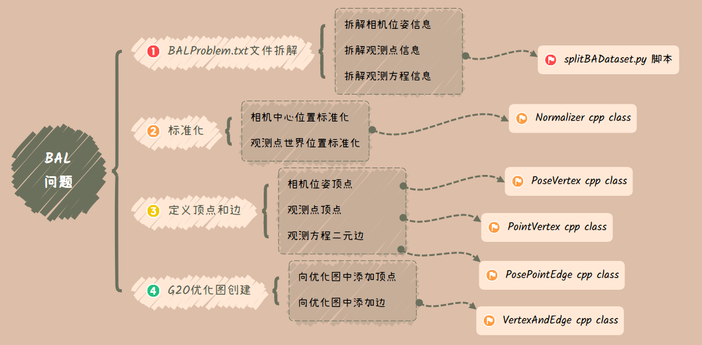
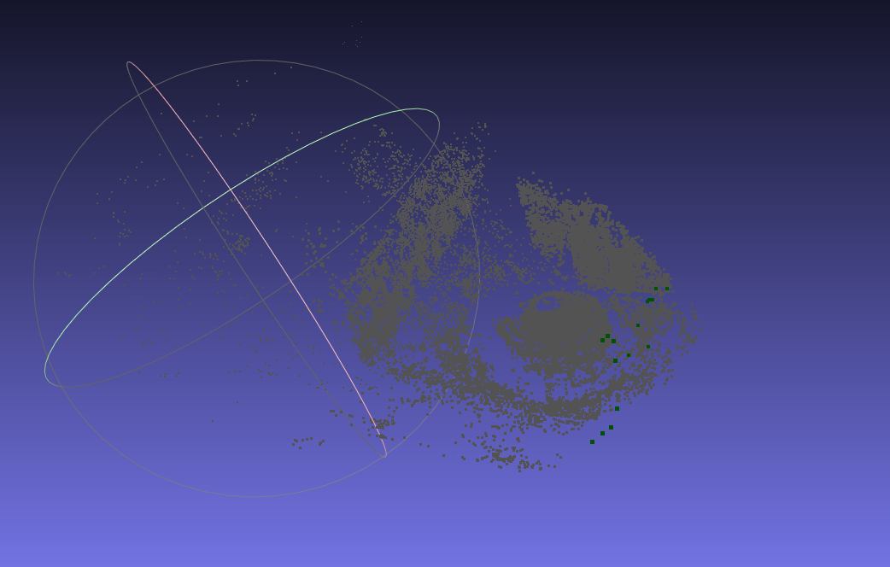
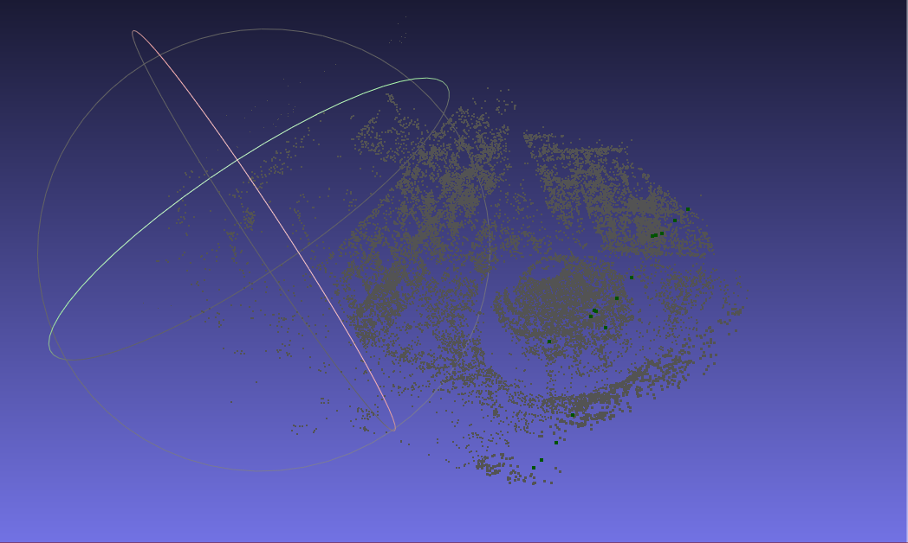

<div>
    <a href="./README.md">English</a>|
    <a href="./README.zh-CN.md">简体中文</a>
</div>

# <center>solveBAL

通过G2O库解决BAL问题，其具体内容包括

- BAL问题的解决以及文件拆解
- 相机位置顶点的定义
- 观测点位置顶点的定义
- 观测方程边的定义
- BAL相机点和观测点的标准化
- 点云`ply`文件的写入和Meshlab展示

## 一、文件内容描述
在res文件夹中，存有`BALProblem.txt`文件，其文件格式如下：
- 第一行为 "相机位姿数", "观测路标数", "产生的观测方程数"
- 第二行至83719行为 "相机位姿id", "观测路标id", "像素坐标系下x", "像素坐标系下y"
- 第83720行至83864行为 至上而下为"相机的旋转向量(三个数)" "相机的平移向量(三个数)" "相机的内参f" "相机的畸变参数k1 k2"
- 其余行为观测点在世界坐标系下的"X Y Z" 值

## 二、项目依赖
- [Ceres 2.1.0 安装指南](http://ceres-solver.org/installation.html)
- [G2O 20230223 安装指南](https://github.com/RainerKuemmerle/g2o/releases)
- [Eigen 3.4 安装指南](https://gitlab.com/libeigen/eigen/-/releases/3.4.0)
- [Sophus 1.22.10 安装指南](https://github.com/strasdat/Sophus/releases/tag/1.22.10)
- MeshLab `sudo apt install meshlab`

## 三、BAL问题拆解
文件的目录结构如下：
```shell
solveBAL
├── build                            # 构建目录
├── cmake                            # cmake脚本目录，寻找Eigen3和G2O库
│   ├── FindEigen3.cmake
│   └── FindG2O.cmake
├── CMakeLists.txt
├── figures
├── include                          # 头文件目录
│   ├── Normalizer.h                 # Normalizer 类定义的头文件
│   ├── PointVertex.h                # PointVertex 类定义的头文件
│   ├── PosePointEdge.h              # PosePointEdge 类定义的头文件
│   ├── PoseVertex.h                 # PoseVertex 类定义的头文件
│   └── VertexAndEdge.h              # VertexAndEdge 类定义的头文件
├── LICENSE
├── README.md
├── res                              # 资源文件目录
│   ├── BALProblem.txt               # 存放BAL问题的文件 
│   ├── CamVertexFile.txt            # splitBADataset.py脚本生成的相机位姿信息
│   ├── EdgeFile.txt                 # splitBADataset.py脚本生成的观测方程信息
│   └── PointVertexFile.txt          # splitBADataset.py脚本生成的世界坐标系下的观测点信息
├── result                           # 程序结果目录
│   ├── Final.ply                    # solveBAL 目标生成的优化后的点云文件
│   ├── final.png                    # 在MeshLab 中优化后的BAL问题展示
│   ├── Init.ply                     # solveBAL 目标生成的优化前的点云文件
│   └── init.png                     # 在MeshLab 中优化前的BAL问题展示
├── scripts                          # 脚本文件目录
│   └── splitBADataset.py            # 拆分BALProblem.txt的Python脚本
├── src                              # 源文件目录
│   ├── main.cpp                     # solveBAL target的程序入口
│   ├── Normalizer.cpp               # Normalizer 类定义的源文件
│   ├── PointVertex.cpp              # PointVertex 类定义的源文件
│   ├── PosePointEdge.cpp            # PosePointEdge 类定义的源文件
│   ├── PoseVertex.cpp               # PoseVertex 类定义的源文件
│   └── VertexAndEdge.cpp            # VertexAndEdge 类定义的源文件
└── test                             # 测试文件夹目录
    ├── angleAxis2RTest.cpp          # angleAxis2R函数测试
    └── lpNormTest.cpp               # Eigen::Vector中的lpNorm函数测试
```

<div align="center">

</div>

## 四、数据标准化

标准化或归一化，是将BAL问题中涉及的所有三维点的中心置0，然后进行一个合适尺度的缩放，使得整个优化过程更加稳定，防止在极端情况下处理很大或者有很大偏移的BA问题。

### 观测点标准化

$$
P_{norm} = \alpha(P-M)
$$

- $P_{norm}$，标准化或归一化后的观测点
- $\alpha$，缩放倍率
- $M$，观测点的中位数

### 相机点标准化

$$
C = -R^{-1} * t \\
C_{norm} = \alpha(C - M)\\
t_{norm} = -R * C_{norm}
$$

- $C$，相机在旋转之前世界坐标系的位置
- $R$，相机的旋转矩阵
- $t$，相机在世界坐标系中的位置
- $C_{norm}$，标准化后的$C$
- $t_{norm}$，标准化后的$t$

## 五、项目运行
```shell
mkdir build && cd build
```
```shell
cmake .. && cmake --bulid . --target solveBAL
```

```shell
meshlab Final.ply Init.ply
```

## 六、结果对比
<div align="center">
    <div>
        <p>优化前：</p>
        
    </div>
    <div>
        <p>优化后：</p>
        
    </div>
</div>
